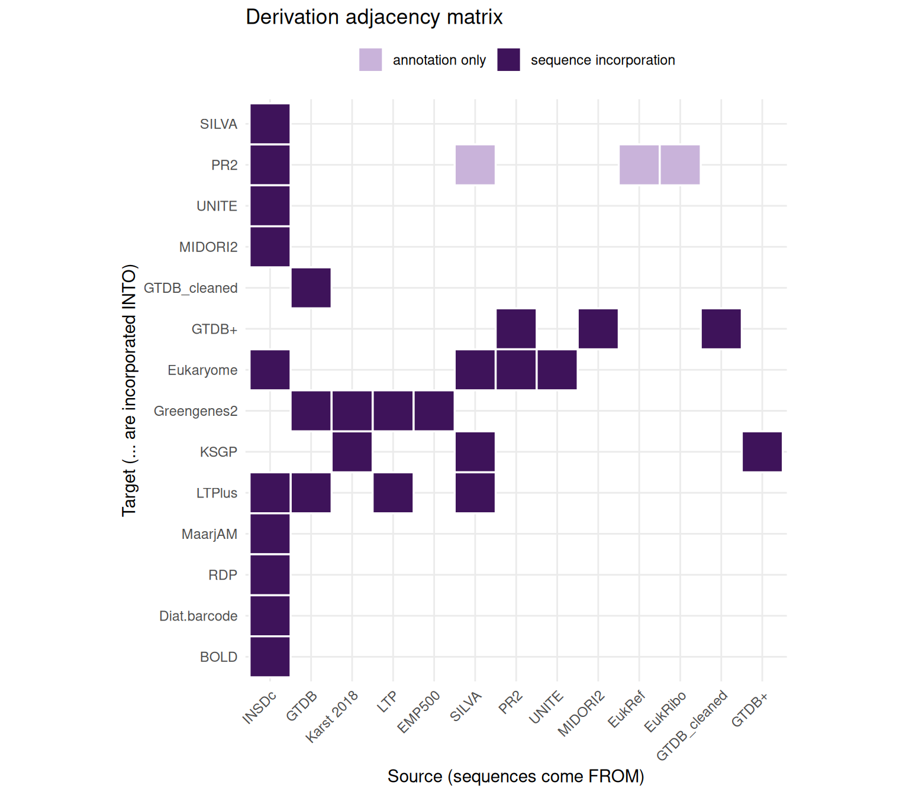
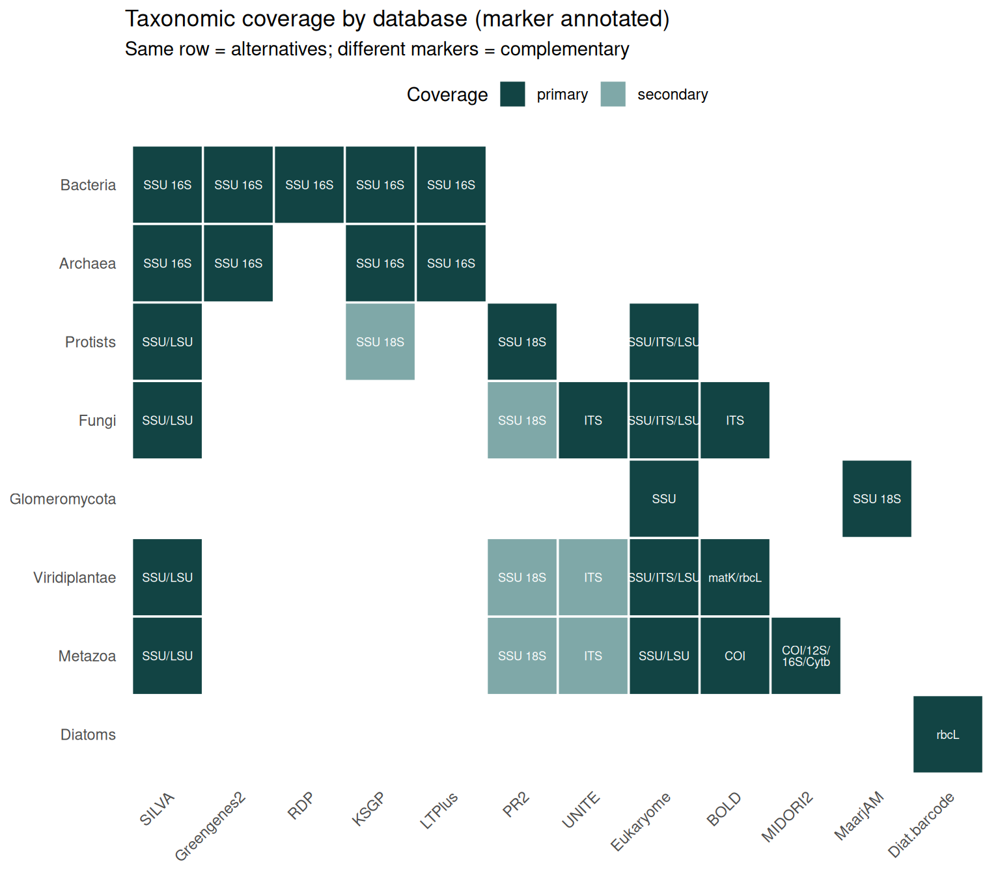

# How reference databases relate: derivation and coverage

Choosing reference databases for taxonomic assignment is not a matter of
picking the single “best” one. Databases relate to each other in two
fundamentally different ways, and confusing them leads to bad choices:

- **Nestedness (sequence derivation).** Some databases *incorporate
  sequences* from others. Using two databases that share a common
  ancestor double-counts the same sequences and gives a false sense of
  corroboration.
- **Coverage overlap (parallel use).** Some databases independently
  cover the same clade or marker. These are genuine *alternatives* — or
  *complements* when their markers differ.

This article maps both relationships from primary sources (official
sites and the describing papers). Every derivation edge below traces to
a sentence stating that one database is built from, incorporates, or
re-annotates another. Where two databases merely cover the same
organisms with independently curated sequences, that is coverage
overlap, **not** derivation, and it is kept in a separate layer.

## The sourced derivation table

Each row is a confirmed sequence-incorporation relationship, with the
primary source. Nodes tagged *(external)* are upstream resources that
are not themselves downloadable through dbpq.

Code

``` r

derivation <- tribble(
  ~from,          ~to,            ~what,                                  ~source,
  # ---- KSGP / GTDB+ lineage (KSGP 3.1, Bahram et al. 2025) ----
  "GTDB",         "GTDB_cleaned", "16S, domain-checked & deduplicated",   "KSGP 3.1 (2025)",
  "GTDB_cleaned", "GTDB+",        "prokaryote 16S backbone",              "KSGP 3.1 (2025)",
  "PR2",          "GTDB+",        "eukaryote 18S + plastid",              "KSGP 3.1 (2025)",
  "MIDORI2",      "GTDB+",        "mitochondrial SSU",                    "KSGP 3.1 (2025)",
  "GTDB+",        "KSGP",         "prokaryote backbone",                  "KSGP 3.1 (2025)",
  "SILVA",        "KSGP",         "Archaea 138.1, re-annotated",          "KSGP 3.1 (2025)",
  "Karst 2018",   "KSGP",         "near-full-length environmental SSU",   "KSGP 3.1 (2025)",
  # ---- Greengenes2 (McDonald et al. 2023) ----
  "GTDB",         "Greengenes2",  "r207 full-length 16S + taxonomy",      "Greengenes2 (2023)",
  "LTP",          "Greengenes2",  "Living Tree Project Jan 2022",         "Greengenes2 (2023)",
  "Karst 2018",   "Greengenes2",  "near-complete 16S",                    "Greengenes2 (2023)",
  "EMP500",       "Greengenes2",  "16S (Earth Microbiome Project)",       "Greengenes2 (2023)",
  # ---- LTPlus (Rossello-Mora et al. 2026) ----
  "LTP",          "LTPlus",       "type-strain backbone",                 "LTPlus (2026)",
  "SILVA",        "LTPlus",       "non-redundant 16S",                    "LTPlus (2026)",
  "GTDB",         "LTPlus",       "16S",                                  "LTPlus (2026)",
  "INSDc",        "LTPlus",       "best-quality NCBI 16S (2019-2025)",    "LTPlus (2026)",
  # ---- EUKARYOME (Tedersoo et al. 2024) ----
  "SILVA",        "Eukaryome",    "v138.1 SSU/LSU",                       "EUKARYOME (2024)",
  "PR2",          "Eukaryome",    "v4.14.1 SSU",                          "EUKARYOME (2024)",
  "UNITE",        "Eukaryome",    "v9.0 ITS",                             "EUKARYOME (2024)",
  "INSDc",        "Eukaryome",    "full-length (meta)genomic reads",      "EUKARYOME (2024)",
  # ---- INSDc (GenBank/EMBL/DDBJ) as the common root ----
  "INSDc",        "PR2",          "18S records (GenBank/EMBL/WGS)",       "PR2 documentation",
  "INSDc",        "SILVA",        "rRNA records",                         "SILVA",
  "INSDc",        "UNITE",        "ITS records",                          "UNITE",
  "INSDc",        "MIDORI2",      "mitochondrial records",                "MIDORI2 (2022)",
  "INSDc",        "MaarjAM",      "Glomeromycota SSU records",            "MaarjAM (2010)",
  "INSDc",        "RDP",          "16S records",                          "RDP",
  "INSDc",        "Diat.barcode", "rbcL records",                         "Diat.barcode",
  "INSDc",        "BOLD",         "barcode records (mirrored to INSDc)",  "BOLD"
)

# Annotation-only links: taxonomy/metadata transfer, NOT sequence incorporation.
annotation <- tribble(
  ~from,     ~to,   ~what,
  "SILVA",   "PR2", "taxonomy/metadata cross-reference",
  "EukRef",  "PR2", "expert taxonomic annotation",
  "EukRibo", "PR2", "taxonomic annotation"
)

knitr::kable(derivation, caption = "Confirmed sequence-derivation edges (source -> target).")
```

| from | to | what | source |
|:---|:---|:---|:---|
| GTDB | GTDB_cleaned | 16S, domain-checked & deduplicated | KSGP 3.1 (2025) |
| GTDB_cleaned | GTDB+ | prokaryote 16S backbone | KSGP 3.1 (2025) |
| PR2 | GTDB+ | eukaryote 18S + plastid | KSGP 3.1 (2025) |
| MIDORI2 | GTDB+ | mitochondrial SSU | KSGP 3.1 (2025) |
| GTDB+ | KSGP | prokaryote backbone | KSGP 3.1 (2025) |
| SILVA | KSGP | Archaea 138.1, re-annotated | KSGP 3.1 (2025) |
| Karst 2018 | KSGP | near-full-length environmental SSU | KSGP 3.1 (2025) |
| GTDB | Greengenes2 | r207 full-length 16S + taxonomy | Greengenes2 (2023) |
| LTP | Greengenes2 | Living Tree Project Jan 2022 | Greengenes2 (2023) |
| Karst 2018 | Greengenes2 | near-complete 16S | Greengenes2 (2023) |
| EMP500 | Greengenes2 | 16S (Earth Microbiome Project) | Greengenes2 (2023) |
| LTP | LTPlus | type-strain backbone | LTPlus (2026) |
| SILVA | LTPlus | non-redundant 16S | LTPlus (2026) |
| GTDB | LTPlus | 16S | LTPlus (2026) |
| INSDc | LTPlus | best-quality NCBI 16S (2019-2025) | LTPlus (2026) |
| SILVA | Eukaryome | v138.1 SSU/LSU | EUKARYOME (2024) |
| PR2 | Eukaryome | v4.14.1 SSU | EUKARYOME (2024) |
| UNITE | Eukaryome | v9.0 ITS | EUKARYOME (2024) |
| INSDc | Eukaryome | full-length (meta)genomic reads | EUKARYOME (2024) |
| INSDc | PR2 | 18S records (GenBank/EMBL/WGS) | PR2 documentation |
| INSDc | SILVA | rRNA records | SILVA |
| INSDc | UNITE | ITS records | UNITE |
| INSDc | MIDORI2 | mitochondrial records | MIDORI2 (2022) |
| INSDc | MaarjAM | Glomeromycota SSU records | MaarjAM (2010) |
| INSDc | RDP | 16S records | RDP |
| INSDc | Diat.barcode | rbcL records | Diat.barcode |
| INSDc | BOLD | barcode records (mirrored to INSDc) | BOLD |

Confirmed sequence-derivation edges (source -\> target). {.table
.caption-top}

## The derivation network

Hover a node to highlight its connections; arrows point from a source to
the database that incorporates it. Square nodes are databases you can
download with dbpq; round nodes are upstream *(external)* sources.

Code

``` r

library(visNetwork)

dbpq_dbs <- c(
  "UNITE", "SILVA", "PR2", "BOLD", "MaarjAM", "Eukaryome",
  "Greengenes2", "RDP", "MIDORI2", "Diat.barcode", "KSGP",
  "GTDB+", "GTDB_cleaned", "LTPlus"
)

all_nodes <- union(c(derivation$from, derivation$to), dbpq_dbs)

nodes <- tibble(id = all_nodes) |>
  mutate(
    group = if_else(id %in% dbpq_dbs, "dbpq database", "external source"),
    label = id
  )

edges <- derivation |>
  transmute(
    from, to,
    title = what,
    arrows = "to",
    color = "#6e2c9b"
  )

visNetwork(nodes, edges, height = "560px", width = "100%") |>
  visGroups(
    groupname = "dbpq database",
    shape = "box", color = "#10677c", font = list(color = "white")
  ) |>
  visGroups(
    groupname = "external source",
    shape = "dot", color = "#9aa0a6"
  ) |>
  visEdges(smooth = list(enabled = TRUE, type = "cubicBezier")) |>
  visNodes(font = list(size = 18)) |>
  visOptions(highlightNearest = list(enabled = TRUE, degree = 1, hover = TRUE)) |>
  visHierarchicalLayout(direction = "LR", sortMethod = "directed") |>
  visLegend(width = 0.15, position = "right", main = "Node type")
```

## The derivation matrix

The same information as an adjacency matrix: a filled cell at row *i*,
column *j* means **“sequences from *i* are incorporated into *j*”**.
Reading down a column tells you everything a database is built from;
reading across a row tells you everywhere a database’s sequences end up.
Annotation-only links (taxonomy transferred without sequences) are shown
in a lighter shade to keep them distinct from true nestedness.

Code

``` r

lvls <- c(
  "INSDc", "GTDB", "Karst 2018", "LTP", "EMP500",
  "SILVA", "PR2", "UNITE", "MIDORI2", "EukRef", "EukRibo",
  "GTDB_cleaned", "GTDB+",
  "Eukaryome", "Greengenes2", "KSGP", "LTPlus",
  "MaarjAM", "RDP", "Diat.barcode", "BOLD"
)

mat <- bind_rows(
  derivation |> transmute(from, to, kind = "sequence incorporation"),
  annotation |> transmute(from, to, kind = "annotation only")
) |>
  mutate(
    from = factor(from, levels = lvls),
    to = factor(to, levels = rev(lvls))
  )

ggplot(mat, aes(x = from, y = to, fill = kind)) +
  geom_tile(color = "white", linewidth = 0.6) +
  scale_fill_manual(
    values = c(
      "sequence incorporation" = "#3e135a",
      "annotation only" = "#c9b3da"
    ),
    name = NULL
  ) +
  labs(
    x = "Source (sequences come FROM)",
    y = "Target (... are incorporated INTO)",
    title = "Derivation adjacency matrix"
  ) +
  coord_fixed() +
  theme_minimal(base_size = 11) +
  theme(
    axis.text.x = element_text(angle = 45, hjust = 1),
    panel.grid = element_line(color = "grey92"),
    legend.position = "top"
  )
```



Three structural facts pop out of the matrix:

- **INSDc (GenBank/EMBL/DDBJ) is the common root.** Almost every
  database ultimately draws its raw sequences from INSDc — “independent”
  means independently *curated*, never sequence-disjoint at the source.
- **KSGP sits at the deepest point.** It pulls from GTDB+, which itself
  pulls from GTDB, PR2 and MIDORI2 — a three-level chain.
- **Eukaryome, Greengenes2 and LTPlus are convergence nodes.** Several
  otherwise independent databases flow into each of them — Eukaryome
  merges SILVA, PR2 and UNITE, while Greengenes2 and LTPlus both
  synthesise the prokaryote 16S space from GTDB and SILVA/LTP.

## Coverage overlap: which databases are alternatives

Nestedness tells you which databases *not* to treat as independent
evidence. Coverage tells you which databases are **interchangeable or
complementary** for a given target. The heatmap below maps each database
to the clades it can assign, annotated with its marker. Two databases in
the same row (same clade) are alternatives; if their markers differ they
are complementary.

Code

``` r

coverage <- tribble(
  ~database,       ~clade,            ~marker,    ~role,
  "SILVA",         "Bacteria",        "SSU 16S",  "primary",
  "Greengenes2",   "Bacteria",        "SSU 16S",  "primary",
  "RDP",           "Bacteria",        "SSU 16S",  "primary",
  "KSGP",          "Bacteria",        "SSU 16S",  "primary",
  "LTPlus",        "Bacteria",        "SSU 16S",  "primary",
  "SILVA",         "Archaea",         "SSU 16S",  "primary",
  "Greengenes2",   "Archaea",         "SSU 16S",  "primary",
  "KSGP",          "Archaea",         "SSU 16S",  "primary",
  "LTPlus",        "Archaea",         "SSU 16S",  "primary",
  "PR2",           "Protists",        "SSU 18S",  "primary",
  "SILVA",         "Protists",        "SSU/LSU",  "primary",
  "Eukaryome",     "Protists",        "SSU/ITS/LSU", "primary",
  "UNITE",         "Fungi",           "ITS",      "primary",
  "SILVA",         "Fungi",           "SSU/LSU",  "primary",
  "Eukaryome",     "Fungi",           "SSU/ITS/LSU", "primary",
  "BOLD",          "Fungi",           "ITS",      "primary",
  "MaarjAM",       "Glomeromycota",   "SSU 18S",  "primary",
  "Eukaryome",     "Glomeromycota",   "SSU",      "primary",
  "SILVA",         "Viridiplantae",   "SSU/LSU",  "primary",
  "Eukaryome",     "Viridiplantae",   "SSU/ITS/LSU", "primary",
  "BOLD",          "Viridiplantae",   "matK/rbcL", "primary",
  "SILVA",         "Metazoa",         "SSU/LSU",  "primary",
  "Eukaryome",     "Metazoa",         "SSU/LSU",  "primary",
  "BOLD",          "Metazoa",         "COI",      "primary",
  "MIDORI2",       "Metazoa",         "COI/12S/\n16S/Cytb", "primary",
  "Diat.barcode",  "Diatoms",         "rbcL",     "primary",
  # secondary (contamination-filtering) coverage
  "UNITE",         "Viridiplantae",   "ITS",      "secondary",
  "UNITE",         "Metazoa",         "ITS",      "secondary",
  "PR2",           "Metazoa",         "SSU 18S",  "secondary",
  "PR2",           "Fungi",           "SSU 18S",  "secondary",
  "PR2",           "Viridiplantae",   "SSU 18S",  "secondary",
  "KSGP",          "Protists",        "SSU 18S",  "secondary"
)

clade_lvls <- c(
  "Bacteria", "Archaea", "Protists", "Fungi", "Glomeromycota",
  "Viridiplantae", "Metazoa", "Diatoms"
)
db_lvls <- c(
  "SILVA", "Greengenes2", "RDP", "KSGP", "LTPlus", "PR2", "UNITE",
  "Eukaryome", "BOLD", "MIDORI2", "MaarjAM", "Diat.barcode"
)

coverage <- coverage |>
  mutate(
    clade = factor(clade, levels = rev(clade_lvls)),
    database = factor(database, levels = db_lvls)
  )

ggplot(coverage, aes(x = database, y = clade)) +
  geom_tile(aes(fill = role), color = "white", linewidth = 0.6) +
  geom_text(aes(label = marker), size = 2.4, color = "white", lineheight = 0.8) +
  scale_fill_manual(
    values = c("primary" = "#124444", "secondary" = "#7fa8a8"),
    name = "Coverage"
  ) +
  labs(
    x = NULL, y = NULL,
    title = "Taxonomic coverage by database (marker annotated)",
    subtitle = "Same row = alternatives; different markers = complementary"
  ) +
  theme_minimal(base_size = 11) +
  theme(
    axis.text.x = element_text(angle = 45, hjust = 1),
    panel.grid = element_blank(),
    legend.position = "top"
  )
```



## Putting it together: practical guidance

Combine the two layers when designing an assignment strategy:

- **Don’t stack nested databases as independent evidence.** Eukaryome
  already contains SILVA, PR2 and UNITE; running UNITE *and* Eukaryome
  on the same fungal ITS reads is not two independent opinions. Likewise
  KSGP, Greengenes2 and LTPlus all draw on GTDB and SILVA/LTP, so treat
  them as variations on one prokaryote 16S resource, not independent
  corroboration.
- **Do combine genuinely independent, complementary databases.** For a
  soil eukaryote survey: **UNITE** (fungal ITS) + **MaarjAM** (AMF SSU,
  a clade UNITE under-resolves) + **PR2** (protist SSU) cover different
  clades and markers with independent curation.
- **Pick the marker-matched primary database per clade** from the
  coverage heatmap, then use secondary coverage (lighter cells) only to
  *flag and remove* off-target reads, not to assign them at fine rank.

## Sources

Derivation relationships were verified against the following primary
sources (June 2026):

- **EUKARYOME** — Tedersoo et al. (2024), *Database*, baae043.
  <https://doi.org/10.1093/database/baae043>
- **KSGP / GTDB+** — Bahram et al. (2025), *ISME Communications*,
  ycaf094; <https://academic.oup.com/ismecommun/article/5/1/ycaf094> and
  <https://ksgp.earlham.ac.uk/>
- **Greengenes2** — McDonald et al. (2023), *Nature Biotechnology*;
  <https://doi.org/10.1038/s41587-023-01845-1>
- **LTPlus** — Rosselló-Móra et al. (2026), *Research Square*;
  <https://doi.org/10.21203/rs.3.rs-9370187/v1> and
  <https://bioinfo.uib.es/ltp/>
- **PR2** — <https://pr2-database.org/> (documentation: sequence sources
  and annotation provenance).
- **SILVA / LTP** — Yilmaz et al. (2014), *NAR*; the All-Species Living
  Tree Project is hosted by SILVA.
- **MIDORI2** — Leray et al. (2022), *Environmental DNA*.
- **MaarjAM** — Öpik et al. (2010), *New Phytologist*.
